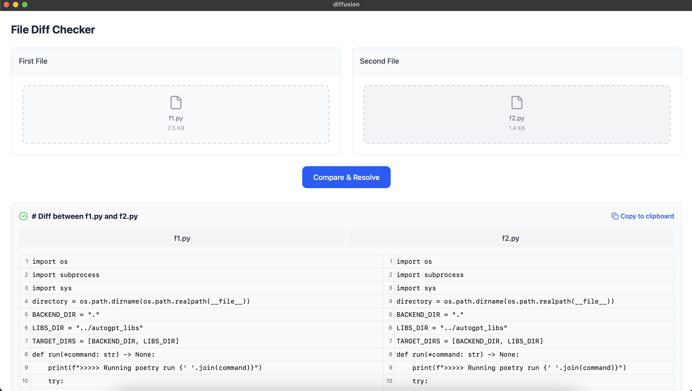

# Diffusion



## About

Diffusion is a powerful file comparison tool built with Tauri, React, and Rust. It helps you identify differences between files using advanced similarity algorithms, with a clean and intuitive user interface for displaying those differences.

## Features

- **File Comparison**: Compare two files and see their differences highlighted
- **Similarity Detection**: Utilizes Rust's similarity crate for intelligent diff generation
- **Cross-platform**: Works on macOS, Windows, and Linux (thanks to Tauri)
- **Modern UI**: Built with React for a responsive and intuitive experience

## Upcoming Features

- Full folder/directory comparison
- Advanced merging capabilities
- Side-by-side comparison view
- Custom rules and filters for comparison
- Search functionality within diffs
- Syntax highlighting for various file formats
- Customizable themes and interface

## Getting Started

### Prerequisites

- [Node.js](https://nodejs.org/) (v16 or newer)
- [pnpm](https://pnpm.io/) - Fast, disk space efficient package manager
- [Rust](https://www.rust-lang.org/) (latest stable version)
- [Tauri CLI](https://tauri.app/v1/guides/getting-started/prerequisites/)

### Installation

1. Clone the repository:
   ```bash
   git clone https://github.com/yourusername/diffusion.git
   cd diffusion
   ```

2. Install dependencies:
   ```bash
   pnpm install
   ```

3. Run the development version:
   ```bash
   pnpm tauri dev
   ```

### Building for Production

To create a production build:

```bash
pnpm tauri build
```

## Architecture

Diffusion utilizes a hybrid architecture:

- **Frontend**: React-based UI that displays file differences in a user-friendly way
- **Backend**: Rust-powered processing using Tauri's invoke system
- **Core Functionality**: Leverages Rust's similarity crate for efficient and accurate diff generation

## Contributing

Contributions are welcome! Feel free to submit issues or pull requests.

1. Fork the repository
2. Create your feature branch: `git checkout -b feature/amazing-feature`
3. Commit your changes: `git commit -m 'Add amazing feature'`
4. Push to the branch: `git push origin feature/amazing-feature`
5. Open a Pull Request

## License

This project is licensed under the MIT License - see the LICENSE file for details.

## Acknowledgments

- Thanks to the Tauri team for making native cross-platform apps with web technologies possible
- The Rust similarity crate developers for the powerful comparison algorithms